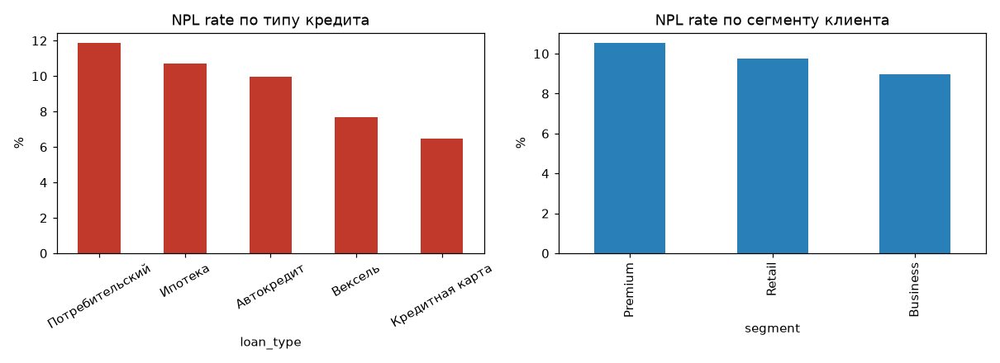

# Bank Loan & Transaction Analytics

Pet-проект для портфолио data-аналитика: сквозной анализ кредитного
портфеля банка — от генерации данных и SQL до Python EDA и дашборда
в Power BI.

Данные полностью синтетические (сгенерированы через `Faker`), но
структура и бизнес-логика приближены к реальному банковскому
продукту: выдача кредитов и векселей, платежи по графику, просрочка,
транзакции по счетам клиентов.

## Зачем этот проект

Показать полный цикл работы аналитика:

1. Проектирование схемы данных (звезда: клиенты — счета — кредиты — платежи — транзакции)
2. SQL-аналитика бизнес-метрик (в т.ч. оконные функции)
3. EDA и визуализация в Python
4. Дашборд для бизнеса в Power BI

## Стек

`PostgreSQL` · `Python (pandas, matplotlib, faker)` · `Power BI` · `DAX`

## Структура репозитория

```
bank-loan-analytics/
├── data/                    # синтетические CSV-датасеты
│   ├── customers.csv
│   ├── accounts.csv
│   ├── loans.csv
│   ├── loan_payments.csv
│   └── transactions.csv
├── sql/
│   ├── 01_schema.sql        # DDL для PostgreSQL
│   └── 02_analysis_queries.sql   # 10 аналитических запросов
├── python/
│   ├── generate_data.py     # генерация датасета
│   └── eda_analysis.py      # EDA + графики
├── powerbi/
│   ├── loans_flat_for_powerbi.csv
│   └── README_powerbi.md    # DAX-меры и структура дашборда
├── images/                  # сохранённые графики
├── requirements.txt
└── README.md
```

## Модель данных

| Таблица         | Описание                                              |
|-----------------|--------------------------------------------------------|
| `customers`      | Клиенты: сегмент (Retail/Premium/Business), город, дата регистрации |
| `accounts`       | Счета клиентов (текущий/сберегательный)                |
| `loans`          | Кредиты и векселя: сумма, ставка, срок, статус         |
| `loan_payments`  | Платежи по графику: план/факт, статус оплаты           |
| `transactions`   | Движения по счетам: пополнения, списания, переводы     |

## Бизнес-вопросы и находки

**1. Как менялась выдача кредитов во времени?**
Объём выдачи растёт неравномерно, с сезонными просадками — видно на
`images/01_monthly_issuance.png` и в SQL-запросе с running total
(`sql/02_analysis_queries.sql`, запрос №2).

**2. Какой тип кредита самый рискованный?**
Наибольший NPL rate — у потребительских кредитов (~12%), наименьший —
у кредитных карт (~6.5%). Ипотека и вексель — где-то посередине.



**3. Есть ли разница по сегментам клиентов?**
Просрочка у Premium-сегмента оказалась чуть выше, чем у Retail и
Business — контринтуитивный результат, который на реальных данных
стоило бы перепроверить на выбросы и объём выборки.

**4. Как ведёт себя портфель по когортам выдачи?**
`images/04_npl_by_cohort.png` показывает NPL rate для каждой
месячной когорты — типовой инструмент кредитного риск-менеджмента.

**5. Кто топ-клиенты по объёму кредитов?**
Запрос №4 в SQL — рейтинг клиентов через `RANK() OVER (...)`.

## Как запустить

```bash
git clone <your-repo-url>
cd bank-loan-analytics
pip install -r requirements.txt

# 1. Сгенерировать данные (уже лежат в /data, но можно пересоздать)
cd python && python generate_data.py

# 2. EDA и графики
python eda_analysis.py

# 3. SQL — поднять локальный PostgreSQL и выполнить:
#    psql -d your_db -f ../sql/01_schema.sql
#    (после этого загрузить CSV командами \copy, см. комментарии в файле)
#    psql -d your_db -f ../sql/02_analysis_queries.sql
```

Для Power BI — см. `powerbi/README_powerbi.md`.

## Возможные доработки

- Добавить прогноз оттока клиентов (логрегрессия/градиентный бустинг)
- Собрать когортный retention-анализ по повторным кредитам
- Перенести пайплайн генерации/загрузки в Airflow-DAG
- Задеплоить дашборд Power BI на Power BI Service со сквозным обновлением

## Дисклеймер

Все данные — синтетические, сгенерированы для демонстрации навыков
аналитики. Не содержат реальной информации о клиентах или банках.

